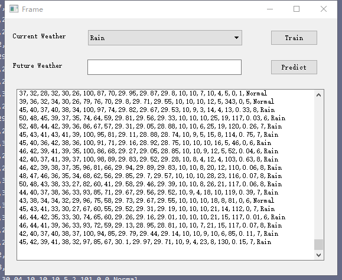
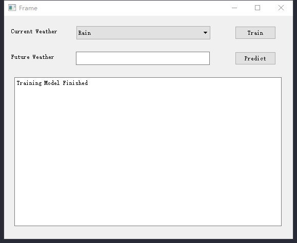

#HMM Weather Predict
**Usage:**
-
**1. Copy training data into train window, like this:**
-
 
-
**2. Click Train button to training model, after training finished, it looks like:**
-

-
**3. Choose a weather like Rain, then press Predict Button, then:**
-

 
**The Future weather comes out ^_^**