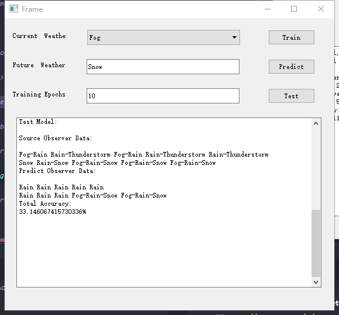

HMM Weather Predict
===
because of the DNS problem, someone can not see pictures blow. if so, please clone or download source code and open it in pycharm or IDE support Markdown

the require packages could be seen in requirements.txt, just use : 
---
    pip install -r requirements.txt 
to install the require packages
---
 
 
 
 
 

---
Usage:
---
**1. Install the software:**
-
 
-
**2. Click the lnk file to open main window:**
-
 
-
**3. Copy training data into train window, like this:**
-
 
-
**4. Click Train button to training model and get the params Matrix**
-
 
-
**5. Click Test button to test model, try different training epoch to find best acc**
-
 
-
**6. Choose a weather like Rain, then press Predict Button, then:**
-
 
-
**The Future weather comes out ^_^**
-
 
 
 
 
 
 

---
Code Structure:
---
**1. Model Segment:** 
-
**hmm_model.py:** main HMM functions, like Baum-Welch alg, Forward & Backword alg, Viterbi alg 

**main_model.py:** source text operate and build data model, utility tools, other math functions, move all functions in hmm_model into the Class HMM 

**2. Data Plot Segment:** 
-
**data_plot.py:** display the data in dataset, like this:

 

**3. Spyder Segment:** 
-
**data_spyder.py:** Crawl some test data from China Meteorological Administration, not a essential part 

**4. UI Segment:** 
-
**newUI.py:** all QT UI structure and functions 

**mainwindow.py:** entrance for UI and QT 
 
 
 
 
 

---
File & Dir Structure:
---
**img_set:** dir for train & test & readme images  

**qtUI:** UI design file dir  

**dataset:** weather train & test dataset  

**\*.py:** python3 file  

**\*.exe:** windows install file  
